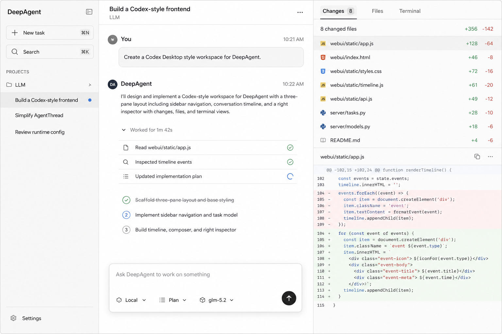

# Codex 工作区前端设计与代码框架



## 1. 目标

把 `deep_agent_sdk/webui` 从事件查看器改造成 DeepAgent 的任务工作区，界面和交互以已确认的 Codex 风格设计图为基准。

首期范围固定为开发工作区：

- Project 和 Task 导航。
- Agent 对话、思考、工具、Plan、审批和追问。
- Changes、Files、Terminal 检查面板。
- Task 重命名、归档、停止和断线恢复。
- 窄屏布局、错误态、空态和加载态。

首期不实现 Skills、Automations、账户中心、插件市场和任意交互式 Shell。

## 2. 当前事实

现有实现已经具备可复用的运行协议：

- `static/api.js` 封装 Session、Timeline、文件和输入接口。
- `static/state.js` 负责 Timeline 事件去重和流式内容合并。
- `static/timeline_model.js` 把 runtime event 折叠成用户可读条目。
- `static/stream_controller.js` 管理 SSE 和 recover queue。
- `UpdateSession` 已支持 title 和 archived status，但前端没有接入。
- `list_files` 和 `/file` 已支持工作区目录和文件内容。
- Timeline 已包含命令工具的参数、流式输出、结果和退出状态。

主要问题不是缺少基础协议，而是页面状态、事件折叠、DOM 渲染和交互流程都集中在少数大文件中：

- `app.js` 同时负责请求、生命周期、事件绑定和页面状态。
- `render.js` 同时负责所有组件、Markdown、工具解析和文件展示。
- `styles.css` 存在多轮重复覆盖，最终样式需要读完整文件才能判断。
- 运行状态同时从本地布尔值、Thread status 和 Timeline 生命周期推断。

这次不在旧结构上继续添加分支，而是保留协议能力，替换前端组织方式。

## 3. 产品模型

前端只展示三个一级概念：

```text
Project -> Task -> Activity
```

它们和后端模型的关系是：

| 前端概念 | 后端事实 | 展示规则 |
| --- | --- | --- |
| Project | `SessionProject` | 工作目录分组 |
| Task | `AgentSession` | 用户可打开、重命名和归档的工作项 |
| Activity | Timeline events | 消息、工具、Plan、审批和系统状态 |

主 Thread 是 Task 的执行细节，不作为一级导航。Child Thread 只在当前 Task 内展示成协作 Agent；用户切换 Agent 时仍停留在同一个 Task。

## 4. 页面结构

```text
AppShell
├── Sidebar
│   ├── NewTaskButton
│   ├── TaskSearch
│   └── ProjectList
│       └── TaskList
├── TaskWorkspace
│   ├── TaskHeader
│   ├── ActivityTimeline
│   ├── AgentStrip
│   └── Composer
└── Inspector
    ├── ChangesPanel
    ├── FilesPanel
    └── TerminalPanel
```

### 4.1 Sidebar

- `New task` 只进入本地空白态，首条消息成功提交时创建 Session。
- Search 在已加载 Task 上立即过滤；服务端分页接入后再扩展远程搜索。
- Project 默认展开当前项目，其余项目记住折叠状态。
- Task 行只显示标题、简短预览和一个状态点。
- Task 菜单提供 Rename 和 Archive，不直接永久删除。

### 4.2 TaskWorkspace

- Header 显示 Task 标题、Project 和运行状态。
- 用户消息使用浅灰背景；Agent 回复不使用气泡。
- 思考、工具和 Plan 归入一个可折叠的工作过程区。
- Approval、Plan input、Interrupt 必须留在原发生位置，同时在 Composer 上方显示待处理提示。
- Composer 在内容区域底部悬浮，不随 Timeline 内容宽度无限增长。

### 4.3 Inspector

- `Changes`：变更文件列表、增删统计、逐文件 Diff、行级评论。
- `Files`：目录树、文本/图片预览、当前文件定位。
- `Terminal`：从 Timeline 中投影命令执行记录和流式输出。
- Inspector 可折叠；折叠状态保存在 localStorage。

## 5. 视觉规格

视觉参数集中在一份 token 文件中，组件样式不得重新定义同义颜色和尺寸。

```css
:root {
  --font-sans: -apple-system, BlinkMacSystemFont, "Segoe UI", sans-serif;
  --font-mono: "SFMono-Regular", Menlo, Consolas, monospace;

  --font-body: 13px;
  --line-body: 20px;
  --font-input: 14px;
  --line-input: 21px;
  --font-meta: 12px;
  --line-meta: 16px;
  --font-code: 12px;
  --line-code: 18px;

  --sidebar-width: 256px;
  --inspector-width: 360px;
  --inspector-collapsed-width: 48px;
  --topbar-height: 48px;
  --content-width: 760px;

  --color-bg: #ffffff;
  --color-sidebar: #f7f7f5;
  --color-panel: #fafafa;
  --color-hover: #efefed;
  --color-selected: #e9e9e7;
  --color-border: #e3e3e0;
  --color-text: #20201f;
  --color-muted: #757572;
  --color-status: #4f75c8;
  --color-added: #eaf6ed;
  --color-removed: #fbeceb;

  --radius-control: 8px;
  --radius-composer: 14px;
}
```

布局规则：

- `>= 1180px`：三栏完整展示。
- `900px–1179px`：Inspector 默认折叠，可覆盖展开。
- `< 900px`：Sidebar 和 Inspector 都使用抽屉，中心区保持完整。
- Timeline 内容宽度固定上限，代码块和 Diff 自己横向滚动。
- 动画只用于侧栏展开、运行指示和新内容进入，时长为 `120ms–180ms`。

## 6. 前端代码框架

继续使用浏览器原生 ES Modules。生产构建不引入 React、Vite 或运行时依赖，Go 仍通过 `embed.FS` 直接发布静态资源。

```text
webui/
├── webui.go
├── docs/
│   ├── codex-workspace-design.md
│   └── codex-workspace-main.png
├── static/
│   ├── index.html
│   ├── app.js
│   ├── favicon.svg
│   ├── api/
│   │   ├── client.js
│   │   ├── sessions.js
│   │   ├── timeline.js
│   │   └── workspace.js
│   ├── state/
│   │   ├── store.js
│   │   ├── reducer.js
│   │   ├── activity.js
│   │   └── selectors.js
│   ├── components/
│   │   ├── app_shell.js
│   │   ├── sidebar.js
│   │   ├── task_workspace.js
│   │   ├── activity_timeline.js
│   │   ├── composer.js
│   │   └── inspector.js
│   ├── features/
│   │   ├── index.js
│   │   ├── tasks.js
│   │   ├── conversation.js
│   │   ├── timeline.js
│   │   ├── approvals.js
│   │   ├── plans.js
│   │   ├── tools.js
│   │   ├── changes.js
│   │   ├── files.js
│   │   └── terminal.js
│   └── styles/
│       ├── index.css
│       ├── tokens.css
│       ├── base.css
│       ├── layout.css
│       └── components.css
└── static_tests/
    ├── reducer.test.mjs
    ├── activity.test.mjs
    ├── timeline_channel.test.mjs
    └── submit_gate.test.mjs
```

### 6.1 启动入口

`app.js` 只负责装配，不包含具体页面逻辑：

```js
import { createAPI } from "./api/client.js";
import { createStore } from "./state/store.js";
import { reduce } from "./state/reducer.js";
import { mountApp } from "./components/app_shell.js";
import { createFeatures } from "./features/index.js";

const api = createAPI({ basePath: "/ad/deep_agent_sdk" });
const store = createStore(reduce);
const features = createFeatures({ api, store });
const app = mountApp(document.querySelector("#app"), {
  store,
  actions: features.actions,
});

app.start();
await features.start();
```

### 6.2 单一状态容器

状态按页面事实分组，但仍只有一个 Store，不增加跨组件事件总线：

```js
export const initialState = {
  catalog: {
    projects: [],
    tasksByProject: new Map(),
    selectedProject: "",
    selectedTaskID: "",
    query: "",
  },
  task: {
    view: null,
    events: [],
    activities: [],
    pending: null,
    runState: "idle",
    contextUsage: null,
  },
  inspector: {
    tab: "changes",
    collapsed: false,
    changes: [],
    selectedPath: "",
    diff: null,
  },
  transport: {
    queueID: "",
    cursor: "",
    connected: false,
  },
};
```

所有状态变化通过明确 action 进入 reducer：

```js
store.dispatch({ type: "task/selected", taskID });
store.dispatch({ type: "timeline/received", events });
store.dispatch({ type: "approval/submitted", eventID, approved });
store.dispatch({ type: "inspector/tabSelected", tab: "files" });
```

不再同时维护 `running`、`stopRequested` 和 DOM class。`runState` 只能是：

```text
idle | running | waiting_approval | waiting_input | stopping | error
```

### 6.3 Timeline 到 Activity

Timeline event 是输入事实，Activity 是唯一展示模型：

```js
export function toActivities(events) {
  const activities = [];
  const openTools = new Map();
  let assistant = null;

  for (const event of events) {
    switch (event.event_type) {
      case "TURN_STARTED":
        appendUserMessage(activities, event);
        assistant = null;
        break;
      case "ASSISTANT_DELTA":
        assistant = appendAssistantDelta(activities, assistant, event);
        break;
      case "ASSISTANT_MESSAGE":
        assistant = finishAssistantMessage(activities, assistant, event);
        break;
      case "TOOL_CALL_STARTED":
      case "TOOL_CALL_OUTPUT_DELTA":
      case "TOOL_CALL_FINISHED":
        mergeToolActivity(activities, openTools, event);
        assistant = null;
        break;
      default:
        appendControlActivity(activities, event);
    }
  }

  return activities;
}
```

这里不再为同一种工具维护普通卡片、Terminal 卡片和 Changes 卡片三份状态。各面板都从同一个 Tool Activity 投影需要的数据。

### 6.4 组件接口

组件接收状态快照和业务 action，不直接调用 `fetch`：

```js
export function createSidebar(root, actions) {
  return {
    render({ catalog, task }) {
      renderProjects(root, catalog, task, actions);
    },
  };
}

export function createComposer(root, actions) {
  return {
    render({ task }) {
      renderInput(root, {
        disabled: task.runState === "stopping",
        pending: task.pending,
        onSubmit: actions.submitMessage,
        onStop: actions.stopTask,
      });
    },
  };
}
```

`features/index.js` 组合 API 和 Store，并向组件提供用户动作；组件不直接请求 API。`app_shell.js` 只负责挂载组件和把状态快照分发给组件。

### 6.5 API 边界

API client 只返回规范化数据，不修改 UI state：

```js
export function createAPI({ basePath }) {
  const request = createJSONRequest(basePath);

  return {
    listProjects: () => request("list_projects"),
    listTasks: (projectName) => request("list_sessions", {
      project_name: projectName,
      status: 1,
      limit: 100,
    }),
    getTask: (sessionID) => request("get_session", {
      session_id: sessionID,
      include_threads: true,
    }),
    updateTask: (sessionID, patch) => request("update_session", {
      session_id: sessionID,
      ...patch,
    }),
    submitInput: (input) => request("submit_input", input),
    stopTask: (sessionID) => request("stop_running", { session_id: sessionID }),
    listChanges: (sessionID) => request("list_changes", { session_id: sessionID }),
    getDiff: (sessionID, path) => request("get_diff", { session_id: sessionID, path }),
  };
}
```

## 7. 后端补充接口

### 7.1 直接复用

以下接口不改变协议：

- `create_session`
- `list_projects`
- `list_sessions`
- `get_session`
- `update_session`
- `submit_input`
- `stop_running`
- `list_timeline`
- `subscribe_timeline`
- `list_files`
- `/file`

### 7.2 Changes

新增两个只读产品接口：

```text
POST /ad/deep_agent_sdk/list_changes
POST /ad/deep_agent_sdk/get_diff
```

请求和响应：

```go
type ListChangesRequest struct {
    SessionID string `json:"session_id"`
}

type ChangeInfo struct {
    Path      string `json:"path"`
    Status    string `json:"status"`
    Additions int    `json:"additions"`
    Deletions int    `json:"deletions"`
}

type GetDiffRequest struct {
    SessionID string `json:"session_id"`
    Path      string `json:"path"`
}

type DiffResponse struct {
    Path      string `json:"path"`
    Patch     string `json:"patch"`
    Truncated bool   `json:"truncated,omitempty"`
}
```

服务端根据 Session 打开 Workspace，只执行固定的 Git 查询。前端不能传命令、工作目录或 Git 参数。非 Git 工作区返回空 Changes，而不是 500。

### 7.3 Diff 评论

Diff 评论只在前端保持结构化，在提交前转换成稳定的 Markdown，再复用现有 `submit_input.content`：

```js
const annotation = {
  path: "webui/static/app.js",
  startLine: 104,
  endLine: 109,
  comment: "这里不要在每个事件上重建 DOM。",
};
```

```text
Review comment:
- File: webui/static/app.js
- Lines: 104-109
- Comment: 这里不要在每个事件上重建 DOM。
```

这样保留路径和行号语义，同时不增加 HTTP IDL、core、worker 或 AC event 协议。路径和行号在前端生成前仍要校验，最终内容作为普通用户输入进入已有运行链路。

### 7.4 Terminal

首期不新增 Shell API。Terminal 数据来自 `exec_command`、`execute` 等 Tool Activity：

```text
tool started -> command block
tool output delta -> append output
tool finished -> exit code / duration / failed state
```

这样 Terminal 展示的每个命令都已经经过 Agent 工具策略和审批链，不产生第二条绕过权限的执行通道。

## 8. 关键流程

### 8.1 打开 Task

```text
select task
  -> cancel previous timeline channel
  -> get_session(include_threads=true)
  -> list_timeline(backward=true)
  -> reducer builds activities and runState
  -> subscribe_timeline(recover_queue_id?)
  -> list_changes + current inspector data
```

异步响应必须携带选中 Task 的 token；旧 Task 的迟到响应不能覆盖新 Task。

### 8.2 发送消息

```text
submit
  -> blank task: create_session
  -> append optimistic user activity
  -> submit_input
  -> remember returned message_id
  -> timeline event replaces optimistic activity
  -> SSE drives assistant/tool/plan updates
```

CreateSession 成功但 SubmitInput 失败时保留 Task，并显示可重试错误，不能静默创建第二个 Session。

### 8.3 断线恢复

```text
SSE disconnected
  -> retry with recover_queue_id
  -> recovery rejected: list_timeline(cursor)
  -> merge by event_id
  -> open a new stream
```

同一个 raw event 只能进入 reducer 一次。`ASSISTANT_DELTA` 和 `TOOL_CALL_OUTPUT_DELTA` 按稳定的 Thread/Turn/Tool key 合并。

### 8.4 Pending input

Approval、Plan input 和 Interrupt 共用一个提交门：

```text
pending event
  -> user submits once
  -> pending enters submitting state
  -> submit_input(resume_ref + payload)
  -> success: runState=running
  -> failure: restore pending and show inline error
```

双击、Enter 和按钮点击不能形成重复 resume。

## 9. 可访问性和交互细节

- 所有 icon button 提供 `aria-label` 和可见 tooltip。
- Sidebar、Inspector tabs、Task menu 和 Approval 操作都支持键盘。
- Focus ring 只在键盘导航时显示。
- 运行状态不能只依赖颜色，同时显示文字或图标。
- Diff 使用可复制文本，不把代码渲染成图片或 Canvas。
- `prefers-reduced-motion` 下关闭非必要动画。
- Composer 使用 `Enter` 提交、`Shift+Enter` 换行，并正确处理 IME composing。

## 10. 测试与验收

### 10.1 Node 单元测试

使用现有 `node:test`，覆盖纯状态和协议逻辑：

```bash
node --test cmd/cloud_agent/deep_agent_sdk/webui/static_tests/*.test.mjs
```

必须覆盖：

- Timeline 去重、排序和 delta 合并。
- Task 快速切换时丢弃迟到响应。
- Run state 的全部状态转换。
- Tool Activity 同时投影到 Timeline 和 Terminal。
- Pending input 防重复提交和失败恢复。
- Task Rename、Archive 和搜索过滤。
- Diff comment 的路径、行号校验和 Markdown 序列化。

### 10.2 Go API 测试

```bash
go test ./cmd/cloud_agent/deep_agent_sdk/...
```

新增覆盖：

- Changes 只能读取 Session 对应 Workspace。
- Path traversal 被拒绝。
- 非 Git 工作区返回空列表。
- Diff 输出大小受限并标记 `truncated`。

### 10.3 浏览器验收

使用真实本地服务验证：

- 1536x1024 三栏布局，与确认设计图同尺寸对照。
- 1179x900 Inspector 折叠。
- 899x900 Sidebar/Inspector 抽屉。
- 流式回复期间页面无明显跳动。
- 切换 Task 不串 Timeline、文件或 Diff。
- 刷新后能够恢复运行状态和 Pending input。
- Approval、Plan input、Interrupt、Stop 都能完成闭环。

视觉截图至少覆盖：

1. 空白 Task。
2. 正在流式运行。
3. Approval 等待。
4. Changes + Diff。
5. Files 预览。
6. Terminal 命令记录。
7. 错误状态。
8. 窄屏抽屉。

截图逐项对照本目录的 `codex-workspace-main.png`，检查栏宽、字号、行高、间距、边框、圆角和色值。

## 11. 改动边界

允许修改：

- `cmd/cloud_agent/deep_agent_sdk/webui/**`
- `cmd/cloud_agent/deep_agent_sdk/service/changes/**`
- 对应 handler、router 和测试。

不修改：

- DeepAgent ReAct loop。
- AgentThread 执行和恢复语义。
- Worker event payload。
- AC mailbox、eventlog 和 Thread 生命周期。
- Session 数据库结构。

## 12. 安全失败与回退

- 新 Changes 接口全部只读，失败不影响对话和 Agent 运行。
- Diff 评论复用原 `content`，不改变 HTTP、worker 和 runtime 协议。
- 新前端不引入数据库迁移，回退只需恢复上一版静态资源并撤销新增只读路由。
- SSE 异常时保留现有 Timeline polling 作为恢复路径。
- 文件、Diff 和 Task 切换使用 AbortController，避免迟到响应污染当前页面。

## 13. 完成标准

只有以下条件同时满足，前端改造才算完成：

- 本文首期范围中的功能全部可操作，不存在只展示不工作的控件。
- Node 和 Go 测试通过。
- 八类浏览器场景都有真实运行截图。
- 视觉尺寸与设计图逐项核对完成。
- 刷新、断线、重复点击、快速切 Task 和后端错误都经过回归。
- 旧 WebUI 重复样式和已经没有调用方的渲染代码被删除。
