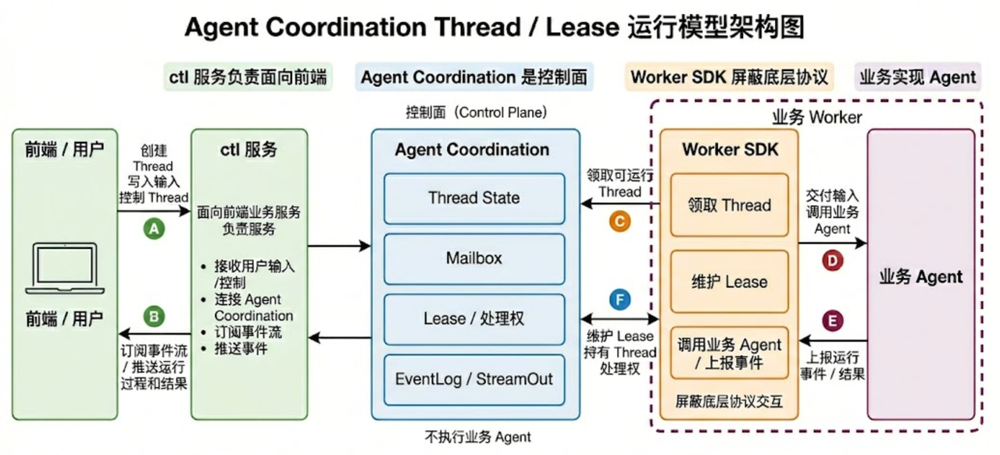
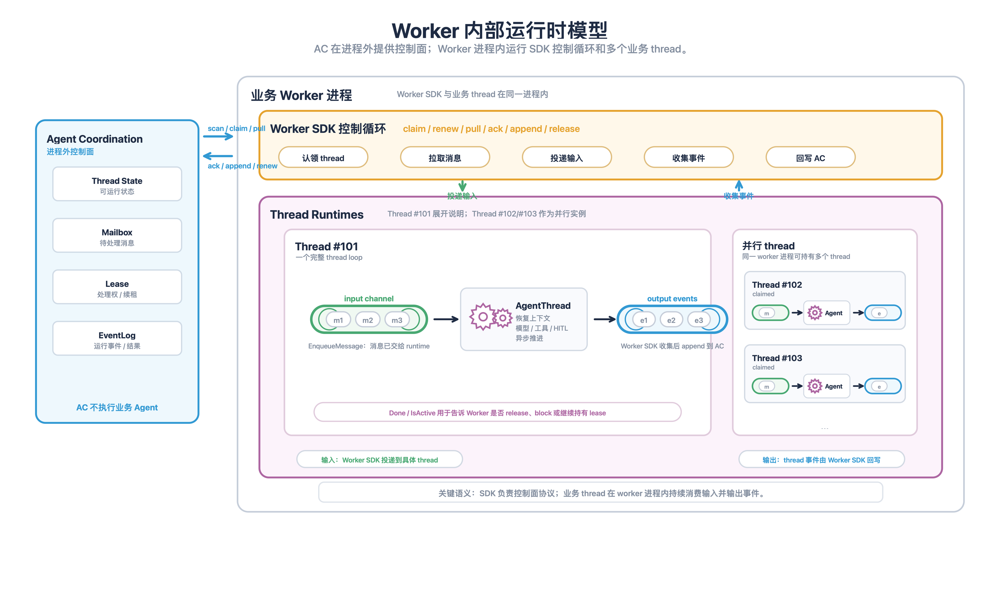

# Agent Worker 机制详解

<callout background-color="light-blue">

Agent Worker 是 CloudAgent 背后的 worker host contract。它定义服务端 worker 如何认领 thread、交付输入、接收 runtime 输出，并把 Agent 的运行过程写回控制面。
</callout>

这不是大多数业务的默认接入层。如果你的目标是复用一套接近成品的服务端 Agent 运行框架，应该先看 [`CloudAgent 接入指南`](../cloudagent/index.md)。

如果你已经来到这一页，通常说明你想理解 CloudAgent 底下的运行机制，或者确实要替换默认 worker/runtime 组装。本文会详细解释 Agent Worker 是什么、为什么需要它、它解决了哪些问题，以及直接接入时业务必须自己承担哪些边界。

## 适用场景

本文主要面向三类读者：

- SDK 维护者：需要理解 CloudAgent 背后的 worker contract。
- CloudAgent 扩展者：需要判断哪些能力应该留在 CloudAgent，哪些能力属于更底层的 Agent Worker。
- 高级接入方：已经决定自己实现服务端 Agent runtime，或者要把已有 runtime 接到 Agent Coordinator。

如果 Agent 的生命周期可以绑定在一次请求、一个进程或一条连接里，通常不需要 Agent Worker。如果业务可以接受 CloudAgent 的默认运行模型，也不需要直接接入 Agent Worker。

只有当你要替换 CloudAgent 的默认 runtime 组装时，问题才会变成：

- 输入从哪里来。
- 用户、系统、其他 Agent 之间如何通信。
- 输出如何在连接断开后继续推流或回放。
- Agent 任务如何被 worker 认领、续租和恢复。
- Agent 如何进入 block、resume、finish 等可控制状态。

Agent Worker 的核心不是“异步执行”，而是定义服务端 worker host 和业务 Agent runtime 之间的交接方式。

## 为什么需要 Agent Worker

在普通请求里，用户连接拥有这次执行。请求结束，执行也结束。在服务端 Agent 场景里，Agent 更适合被看成一个持续推进的任务：

- 用户连接只是输入来源之一。
- 前端订阅只是观察方式之一。
- Agent 的运行状态属于 thread 本身。
- worker 只是持续推进 thread 的执行者。

在 CloudAgent 路径下，这些机制已经被默认组装起来。直接接入 Agent Worker 意味着业务要自己实现 Agent runtime 适配、输入协议、输出事件、状态恢复和错误处理。

因此，Agent Worker 要解决的不是“怎么写一个 Agent”，而是服务端运行层面的几件事：

- 多个 worker 进程如何安全地抢占和推进同一个 thread。
- 新输入如何可靠地投递给当前持有 thread 的 runtime。
- runtime 接收输入和真正处理完成之间如何区分。
- runtime 产生的事件如何按顺序写回并供前端或调用方回放。
- 当前 worker 何时应该继续持有 thread，何时应该 release、block 或 close。
- worker 异常退出后，控制面如何重新调度后续处理。

## 全局架构



全局视角下，一套服务端 Agent 后端通常由四部分组成。

| 部分 | 职责 |
| --- | --- |
| 前端 / ctl 服务 | 接收用户输入，创建或控制 thread，订阅事件流并推送给前端 |
| Agent Coordinator | 控制面，管理 thread state、mailbox、lease、event log / stream out |
| Worker SDK | 业务侧 worker runtime，屏蔽 scan、claim、pull、ack、renew、append event、release 等底层协议 |
| 业务 Agent | 真正执行模型、工具、上下文、HITL、业务逻辑的 Agent runtime |

这个结构里，Agent Coordinator 不执行业务 Agent。它负责保存 thread 状态、输入队列、处理权和事件流。业务 Agent 也不需要直接理解控制面的所有协议。`agentworker` 负责把两者连接起来。

## Worker 服务内部结构

接入 Worker SDK 后，一个 worker 服务内部通常是以下结构：



这张图表达的是运行流程，不是模块依赖关系。

一个 worker 进程里可以同时 claim 多个 coordinator thread。每个 claimed thread 都会对应一个业务侧 `AgentThread` 实例。可以把每个 `AgentThread` 理解成一个持续运行的 thread loop：

- 从自己的 input channel 持续接收 message。
- 调用业务 Agent runtime 处理输入。
- 把运行过程、阻塞状态和结果持续写入 output channel。

这里的 channel 是运行模型上的输入 / 输出通道。业务实现可以用 Go channel、内存队列、runtime 自己的输入队列，或者 `deepagents/agentthread` 已有的 pending input 机制；关键语义是“Worker 负责交付输入，业务 thread 持续处理并输出事件”。

`agentworker/cloud.Worker` 负责和 Agent Coordinator 协作：

- scan 可运行 thread。
- claim thread lease。
- 维护 lease。
- pull pending message。
- 调用业务 `AgentThread.PostMessage`。
- ack 已交付的 message。
- append 业务 runtime 产生的 event。
- 根据 `ThreadOutput.Items` 里的 yield、block 状态或 idle timeout release thread。

业务自己的 `AgentThread` 负责 thread 内部语义：

- 初始化 thread-scoped runtime。
- 恢复 history / checkpoint / sandbox / 工具状态。
- 把 coordinator message 转成 runtime 输入。
- 异步推进模型、工具、HITL、子任务等业务逻辑。
- 把 runtime 输出转换成 coordinator event。
- 在当前 claim 需要 release / block / stop 时，通过 `ThreadOutput.Items` 发出 yield。

`cmd/cloud_agent` 是当前仓库里的参考业务实现。它通过 `cloudagent/worker` 把 `deepagents/agentthread` 适配成 `agentworker.AgentThread`，用于 dogfood 业务接入路径。

## 核心边界

Agent Worker 由两部分配合完成：

- Agent Coordinator 是服务端控制面，提供 thread 状态、mailbox、lease、event log、stream out 等通用能力。
- `agentworker` 是业务侧 worker 框架，负责把业务 Agent runtime 接到 Agent Coordinator。

`agentworker` 负责通用 worker 生命周期，不理解模型请求边界、ReAct loop、prompt 拼装、业务工具语义和前端展示协议。

业务仍然负责自己的 Agent 本体：

- 为每个 claimed thread 创建自己的 Agent runtime。
- 把输入 message 转成 runtime 能理解的输入。
- 把 runtime 输出转成对外 event。
- 建设上下文管理、状态存储、工具、skill、sandbox。
- 决定模型策略、HITL 语义、事件协议和产品协议。

如果业务只能绕过 SDK 或在 `cmd` 层堆大量控制面协议，通常说明 SDK 边界仍需要继续调整。如果只是业务自己的展示、命名、权限、协议转换，则不应该进入 `agentworker` 核心抽象。

## 接入接口

业务实现公共的 `agentworker.AgentThread`，再把它交给具体 host。接 Agent Coordinator 时使用 `agentworker/cloud`：

```go
type AgentThreadFactory func(ctx context.Context, threadInfo *ac.Thread) (agentworker.AgentThread, error)
```

每个被 claim 的 coordinator thread，会创建一个业务侧 `AgentThread`。`ac.Thread` 只出现在 cloud factory 里，不进入公共 runtime contract。

```go
type AgentThread interface {
    Init(ctx context.Context) (*agentworker.ThreadOutput, error)
    PostMessage(ctx context.Context, msg *agentworker.Message) (*agentworker.PostMessageResult, error)
    Interrupt(ctx context.Context, req agentworker.ThreadInterruptRequest) error
    ActiveTurn() *agentworker.ActiveTurn
    Close(ctx context.Context) error
}

type PostMessageResult struct {
    TurnID string
}

type ThreadOutput struct {
    Items <-chan agentworker.ThreadOutputItem
}

type ThreadOutputItem struct {
    Event  *agentworker.Event
    Yield  *agentworker.ThreadYield
}
```

方法语义如下：

- `Init`：初始化 thread-scoped runtime，返回唯一的有序输出流。
- `PostMessage`：把一条 host-agnostic message 投递给 runtime。
- `Interrupt`：把 cancel input / close thread 这类控制面请求交给 runtime。返回 nil 表示 runtime 已接受打断请求，不表示 active turn 已经同步结束；worker 会继续观察 `ActiveTurn` 和 `ThreadOutput.Items`。
- `ActiveTurn`：返回当前唯一 active turn；返回 nil 表示 runtime inactive 且不会再为上一轮输出 event。
- `Close`：释放 runtime 资源。

`PostMessage` 返回 nil 只表示 runtime 已经接收 message，不表示这条 message 已经处理完成。runtime 输出必须通过 `ThreadOutput.Items` 发出；event 和 yield 共用一个有序流，避免 yield 先到导致尾部 event 丢失。

`PostMessage` 必须快速返回。它可以启动异步 turn、把输入追加到活跃 turn，或把输入放入 runtime 自己的队列。只要返回 nil，`agentworker` 就会 ack 这条 message。

如果 runtime 已经被 `Close` 关闭，`PostMessage` 应返回 `agentworker.ErrThreadClosed`。此时 cloud worker 不会 ack 当前 message，而是释放当前 claim，让控制面后续重新调度或由上层处理。

`ThreadOutput.Items` 是 runtime 的异步输出。业务 runtime 产生的 event 会被 host 追加到 Agent Coordinator；yield 用来通知当前 claim 可以交还给 host。yield 不是 thread 生命周期决策，host 会结合 block、close control、错误和 idle timeout 决定 release、block 或 complete close。

## In-Process Host Contract

`agentworker/inprocess` 是单进程 host。它接收外部 `ThreadStateStore`、`EventStore` 和 `ThreadFactory`，自己只持有 live `AgentThread` actor。durable thread state、event replay、session timeline merge、message status 和 API 展示都仍由调用方拥有。

`Worker.PostMessage` 的成功语义和 cloud host 的 message ack 对齐：

- success 表示 live runtime 已经接受这个 thread 的 message。
- success 不表示 turn 已完成，也不表示已经产生 terminal event。
- success 不要求 `inprocess` 持久化 message status；调用方可以在 `inprocess` 外维护 queued / accepted / rejected 状态。
- failure 会暴露 host/runtime 边界错误，例如 missing thread id、invalid message、closed thread、blocked thread、store failure、runtime rejection 或 actor shutdown。

`Worker.InterruptThread` 是 single-thread live actor primitive。它用 `thread_id` 找到内存里的 runtime，并把 `agentworker.ThreadInterruptRequest` 交给 `AgentThread.Interrupt`：

- closed thread 返回 `ErrThreadClosed`。
- 没有 live actor 时返回 `Status=no_live_actor`，不会为了 interrupt 创建 runtime。
- live actor 没有 active turn 时返回 `Status=no_active_turn`。
- runtime 接受 interrupt 时返回 `Status=accepted` 和 active turn 快照。
- success 只表示 interrupt request 已被 runtime 接收；调用方仍要通过 event subscription 或 event log 观察 interrupted / terminal output。

`Worker.SubscribeSessionEvents` 是 session live fanout primitive。它只推送订阅建立后的 live events，不做历史 replay、排序、de-dupe 或 recover cursor。调用方如果要构建完整 session timeline，推荐顺序是：

1. 先调用 `SubscribeSessionEvents(sessionID)` 建立 live buffer。
2. 再通过自己的 thread/event store 拉取历史 events。
3. 按 event id 去重并合并历史和 live events。

thread-level `SubscribeThreadEvents` 仍然只观察单 thread。session-level fanout 按 actor 所属 session 发送，`FanoutToSession=false` 的 event 不进入 session stream，但不影响 thread-level subscription。

## 运行流程

业务启动一个 cloud worker。

```go
w := &cloud.Worker{
    Namespace:          namespace,
    Env:                env,
    Client:             coordinatorClient,
    AgentThreadFactory: factory,
    Concurrency:        100,
}

err := w.Run(ctx)
```

运行中，worker 会不断：

1. 扫描当前 namespace / env 下可运行的 thread。
2. claim 成功后启动 lease 续租。
3. 调用 `AgentThreadFactory` 创建业务 runtime。
4. 调用 `AgentThread.Init` 初始化 runtime，并取得 `ThreadOutput`。
5. 先投递 claim 返回的 pending messages。
6. 持续 pull 新 message。
7. 把 coordinator message 转成 `agentworker.Message`，调用 `AgentThread.PostMessage` 投递给 runtime。
8. 投递成功后 ack message。
9. 将 `ThreadOutput.Items` 里的 event 写入 Agent Coordinator event log。
10. 根据 `ThreadOutput.Items` 里的 yield、block 状态、错误或 idle timeout release thread。

业务不需要自己写 scan / claim / ack / renew / append / release 这些通用逻辑。

## Message、Event 与 Ack

在公共 Agent Worker 层，输入是 `agentworker.Message`，输出是 `agentworker.Event` / `agentworker.ThreadYield`。`agentworker/cloud` 负责和 coordinator 类型互转。

- message 是业务 runtime 的结构化输入。
- event 是前端、调用方、其他系统观察 Agent 的事实。
- ack 表示 runtime 已经接收 message，不表示这条 message 已经处理完成。

`agentworker.MessageTypeText` 只是历史默认值。新的业务输入协议不应该继续往 `agentworker` 基础包里增加 message type，而应该在自己的协议层定义 payload 和 type，再通过 `agentworker.Message` 承载。

推荐业务至少区分这些 event：

- turn start。
- LLM start / token / end。
- tool start / end。
- HITL required。
- turn blocked。
- turn end。
- turn error。

`agentworker` 不规定 event payload 协议。业务需要自己设计 payload，并保证前端、调用方和工具能读懂。

`agentworker/cloud` 额外公开了两个 coordinator mailbox 控制消息：

- `cloud.MessageTypeControlCancelInput` / `cloud.CancelInputControlPayload`：取消某条 cutoff message 之前的输入，并请求 runtime interrupt 当前 active turn。
- `cloud.MessageTypeControlCloseThread` / `cloud.CloseThreadControlPayload`：关闭 thread。worker 会 ack close control、打断 active turn、调用 runtime `Close`，最后调用 coordinator 的 close complete 接口。

这些控制消息是 cloud host 和控制面之间的协议，不是业务普通输入。业务 runtime 只通过 `AgentThread.Interrupt` 和 `Close` 感知它们。

生产环境通常需要满足至少一种条件：

- runtime 自己持久化 inbox。
- runtime 的处理逻辑可幂等恢复。
- 业务能通过 history、checkpoint 或 event log 补偿。

如果只是本地 demo，可以先用内存队列，但不要把它当成生产级可靠性。

## 和 Agent Thread 的关系

`agentworker.AgentThread` 是 worker 层接口。

它不等于 `deepagents/agentthread` 里的 Agent Thread 实现。

业务可以用 `deepagents/agentthread` 实现这个接口，也可以用自己的 runtime 实现这个接口。

典型关系是：

```plaintext
agentworker.AgentThread
  - 接收 coordinator message
  - 输出 coordinator event
  - 包装业务自己的 Agent runtime

deepagents/agentthread
  - 处理模型、工具、上下文、HITL、pending input
  - 不依赖 Agent Coordinator
```

这两个概念要保持解耦。

## Task Tool

`agentworker.TaskTool` 提供通用的跨 thread 工具：

- `spawn_task`
- `send_message`
- `wait_message`

它封装 Agent Coordinator 的通用请求，但不定义业务自己的 thread 命名、角色、父子关系、展示文案和权限语义。

如果业务需要这些信息，应在业务层通过 `Metadata`、`ResolveTarget`、`OnThreadSpawned`、`FormatOutbound`、`MessageWaitObserver` 等扩展点表达。SDK 保证 metadata 的承载位置和合并优先级稳定，但不定义具体 key 的业务含义。`cmd/cloud_agent` 里的 thread ref、main / child role、`from_thread_ref`、`parent_thread_id`、`root_thread_id` 都属于参考业务协议，不是 `agentworker` 核心协议。

## 直接接入前的检查

直接接入 Agent Worker 前，业务至少要准备：

- 一个 Agent Coordinator namespace / env。
- 一个 `cloud.Worker` 或 `inprocess.Worker` 启动入口。
- 一个 `AgentThreadFactory`。
- 一个业务 `AgentThread` 实现。
- 一套 message payload 协议。
- 一套 event payload 协议。
- runtime 需要的 history / checkpoint / 状态存储。
- 前端或调用方的事件消费方式。
- 如需多 Agent 通信，一套 thread target / metadata / wait 语义。

参考实现：

- `cmd/cloud_agent`

它们是 dogfood / reference example，用来验证 SDK 接入形态和边界，不是 SDK 核心 API。

## 常见误解

- Agent Worker 不是“异步执行工具”，而是把 Agent 生命周期从单次请求或连接里移到 thread / worker runtime 上。
- `PostMessage` 返回 nil 只表示 runtime 接收了 message；ack 也只表示已交付，不表示这条 message 已经处理完成。
- `agentworker` 不理解模型请求、ReAct loop、prompt、工具语义或前端展示协议，这些属于业务 Agent runtime。
- `ThreadOutput.Items` 里的 event 和 yield 共用有序流；不要用旁路状态判断替代 runtime 输出。
- `cmd/cloud_agent` 是参考业务实现，不是 `agentworker` 核心 API；它的 session、thread ref 和展示语义不要下沉到 `agentworker`。

## 下一步

- 想使用接近成品的服务端 Agent 运行框架：回到 [`CloudAgent 接入指南`](../cloudagent/index.md)。
- 想实现业务侧多轮 runtime：继续看 [`Agent Thread 接入指南`](../agentthread/index.md)。
- 想理解一次模型 + 工具执行体：继续看 [`DeepAgent 接入指南`](../deepagent/index.md)。
- 想了解 TaskTool、工具和可组合能力：继续看 [`内置工具说明`](../deepagent/builtin-tools.md)。
