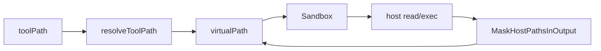

### Goal

- 现状：工具 `resolveRoot()` / `getResolvedPath()` ```14:45:backend/agent/tools/path.go```；仅 `shouldUseSandbox`（`/mnt/` 前缀）走沙箱 ```13:16:backend/agent/tools/sandbox_helper.go```；local 挂载无 `/mnt/repo` ```57:76:backend/sandbox/local/manager.go```
- 目标：`hasSandboxManager` 时工具入参 → `virtualPath`；沙箱 IO → `hostPath`；返回 agent 的文本经 `MaskHostPathsInOutput` 再变回 `virtualPath`
- 磁盘布局：[session-run-unify](specs/2026-05-24-session-run-unify/design.md)



### Implementation

**`backend/sandboxpaths/paths.go`**（新包，import `eino-cli/backend/sandboxpaths`）

```go
package sandboxpaths

const (
	VirtualPathPrefixRepo      = "/mnt/repo"
	VirtualPathPrefixWorkspace = "/mnt/workspace"
	VirtualPathPrefixUploads   = "/mnt/uploads"
	VirtualPathPrefixOutputs   = "/mnt/outputs"
	VirtualPathPrefixSkills    = "/mnt/skills"
)

type MountMapping struct {
	VirtualPath string
	HostPath    string
	ReadOnly    bool
}

func BuildMountMappings(sessionID string) ([]MountMapping, error) {
	if err := config.EnsureSessionDirs(sessionID); err != nil {
		return nil, err
	}
	prefixToHostPath := map[string]string{
		VirtualPathPrefixRepo:      config.RootDir(),
		VirtualPathPrefixWorkspace: config.SandboxWorkDir(sessionID),
		VirtualPathPrefixUploads:   config.SandboxUploadsDir(sessionID),
		VirtualPathPrefixOutputs:   config.SandboxOutputsDir(sessionID),
	}
	out := []MountMapping{}
	if skillsHostPath := GetSkillsHostPath(); skillsHostPath != "" {
		out = append(out, MountMapping{
			VirtualPath: VirtualPathPrefixSkills,
			HostPath:    skillsHostPath,
			ReadOnly:    true,
		})
	}
	for virtualPathPrefix, hostPath := range prefixToHostPath {
		out = append(out, MountMapping{
			VirtualPath: virtualPathPrefix,
			HostPath:    hostPath,
			ReadOnly:    false,
		})
	}
	return out, nil
}

func GetSkillsHostPath() string {
	skillsRoot := filepath.Join(config.RootDir(), "backend", "skills")
	info, err := os.Stat(skillsRoot)
	if err != nil || !info.IsDir() {
		return ""
	}
	hostPath, err := filepath.Abs(skillsRoot)
	if err != nil {
		return ""
	}
	return hostPath
}
```

**`backend/sandbox/mask.go`** — 自 ```99:122:backend/sandbox/local/paths.go``` 抽出；`local` 删除 `reverseResolvePathsInOutput` 等重复符号。

```go
package sandbox

// 例：output 含 "/Users/u/proj/backend/a.go" + mapping repo→/mnt/repo → "/mnt/repo/backend/a.go"
func MaskHostPathsInOutput(mappings []sandboxpaths.MountMapping, output string) string { /* 见下文完整实现 */ }
func maskReverseResolvePath(mappings []sandboxpaths.MountMapping, path string) string { /* ... */ }
func findHostPathMapping(mappings []sandboxpaths.MountMapping, path string) (*sandboxpaths.MountMapping, string) { /* ... */ }
func hostPathRel(hostPath, path string) (string, bool) { /* ... */ }
func absPath(path string) string { /* ... */ }
func sortedMountMappings(mappings []sandboxpaths.MountMapping, less func(a, b sandboxpaths.MountMapping) bool) []sandboxpaths.MountMapping { /* ... */ }
```

完整实现（与现网 `reverseResolvePathsInOutput` 等价，字段改为 `VirtualPath`/`HostPath`）：

```go
func MaskHostPathsInOutput(mappings []sandboxpaths.MountMapping, output string) string {
	if len(mappings) == 0 || output == "" {
		return output
	}
	result := output
	for _, m := range sortedMountMappings(mappings, func(a, b sandboxpaths.MountMapping) bool {
		return len(a.HostPath) > len(b.HostPath)
	}) {
		hostPath, err := filepath.Abs(m.HostPath)
		if err != nil {
			continue
		}
		pattern := regexp.QuoteMeta(hostPath) + `(?:[/\\][^\s"';&|<>()]*)?`
		re, err := regexp.Compile(pattern)
		if err != nil {
			continue
		}
		result = re.ReplaceAllStringFunc(result, func(match string) string {
			return maskReverseResolvePath(mappings, match)
		})
	}
	return result
}

func maskReverseResolvePath(mappings []sandboxpaths.MountMapping, path string) string {
	cleaned := absPath(filepath.FromSlash(path))
	m, rel := findHostPathMapping(mappings, cleaned)
	if m == nil {
		return cleaned
	}
	if rel == "" {
		return m.VirtualPath
	}
	return strings.TrimRight(m.VirtualPath, "/") + "/" + filepath.ToSlash(rel)
}

func findHostPathMapping(mappings []sandboxpaths.MountMapping, path string) (*sandboxpaths.MountMapping, string) {
	var best *sandboxpaths.MountMapping
	bestRel := ""
	bestLen := -1
	for i := range mappings {
		hostPath, err := filepath.Abs(mappings[i].HostPath)
		if err != nil {
			continue
		}
		if rel, ok := hostPathRel(hostPath, path); ok && len(hostPath) > bestLen {
			best, bestRel, bestLen = &mappings[i], rel, len(hostPath)
		}
	}
	return best, bestRel
}

func hostPathRel(hostPath, path string) (string, bool) {
	if path == hostPath {
		return "", true
	}
	sep := string(filepath.Separator)
	if strings.HasPrefix(path, hostPath+sep) {
		return strings.TrimPrefix(path[len(hostPath):], sep), true
	}
	return "", false
}

func absPath(path string) string {
	cleaned, err := filepath.Abs(path)
	if err != nil {
		return path
	}
	return cleaned
}

func sortedMountMappings(mappings []sandboxpaths.MountMapping, less func(a, b sandboxpaths.MountMapping) bool) []sandboxpaths.MountMapping {
	sorted := append([]sandboxpaths.MountMapping(nil), mappings...)
	sort.SliceStable(sorted, func(i, j int) bool { return less(sorted[i], sorted[j]) })
	return sorted
}
```

**`backend/sandbox/local/`** — 删除 `PathMapping`；`resolvePath` / `findPathMapping` 等改用 `[]sandboxpaths.MountMapping`（字段 `ContainerPath`→`VirtualPath`，`LocalPath`→`HostPath`，纯 rename）。

```go
// local.New → sandboxpaths.BuildMountMappings(sessionID) → newSandbox(..., mounts)
func (s *Sandbox) ReadFile(ctx context.Context, virtualPath string) (string, error) {
	// resolvePath(s.mounts, virtualPath) → os.ReadFile；去掉 agentWritten 门闩
	return sandbox.MaskHostPathsInOutput(s.mounts, content), nil
}
// ExecuteCommand / ListDir / Glob / Grep 返回字符串出口同样 mask
```

**`backend/sandbox/aio/manager.go` + `sandbox.go`**

```go
func (m *Manager) buildMounts(ctx context.Context) []mountSpec {
	mounts, _ := sandboxpaths.BuildMountMappings(m.sessionID)
	out := []mountSpec{}
	for _, mm := range mounts {
		out = append(out, mountSpec{Host: mm.HostPath, Container: mm.VirtualPath, ReadOnly: mm.ReadOnly})
	}
	return out
}

// aio.Sandbox 构造时缓存 BuildMountMappings(sessionID)；ReadFile/ExecuteCommand/ListDir/Glob/Grep 返回前 MaskHostPathsInOutput
```

**`backend/agent/tools/sandbox_helper.go`** — 删除 `shouldUseSandbox`；新增：

```go
func hasSandboxManager(manager sandbox.SandboxManager) bool { return manager != nil }
```

**`backend/agent/tools/virtualpath.go`**（新）

```go
func resolveToolPath(ctx context.Context, toolPath string, readOnly bool) (virtualPath string, err error) {
	toolPath = strings.TrimSpace(toolPath)
	if toolPath == "" {
		return "", fmt.Errorf("path must not be empty")
	}
	virtualPath, err = buildAbsoluteVirtualPath(toolPath)
	if err != nil {
		return "", err
	}
	return virtualPath, validateVirtualPath(virtualPath, readOnly)
}

func buildAbsoluteVirtualPath(toolPath string) (string, error) {
	if strings.HasPrefix(toolPath, "/") {
		return toolPath, nil
	}
	return sandboxpaths.VirtualPathPrefixRepo + "/" + strings.TrimPrefix(toolPath, "/"), nil
}

func validateVirtualPath(virtualPath string, readOnly bool) error { /* 前缀白名单 + skills 只读 */ }
```

**文件工具**（`hasSandboxManager` 分支同构；否则保留 `getResolvedPath` + `os.*`）：

| 文件 | 字段 | readOnly |
|------|------|----------|
| `read_file.go` | `FilePath` | true |
| `write_file.go` | `FilePath` | false |
| `edit_file.go` | `FilePath` | false |
| `delete_file.go` | `FilePath` | false |
| `glob.go` | `Path` | true |
| `grep.go` | `Path` | true |
| `ls.go` | `Path` | true |

```go
if hasSandboxManager(sandboxManager) {
	virtualPath, err := resolveToolPath(ctx, in.FilePath, readOnly)
	// getRequiredSandbox → sandbox.ReadFile/WriteFile/...（virtualPath）
	return /* 已 mask，不再 tools 二次处理 */
}
// 无 manager：现有 getResolvedPath + 主机 FS
```

**`apply_patch.go` / `rg.go` / `semantic_search.go` / `read_lints.go`** — 路径参数在 `hasSandboxManager` 时对根目录参数 `resolveToolPath`；patch 内路径若仍为 host 相对路径，首版可仅依赖 prompt 要求 `/mnt/repo`（或后续在 patch 解析层补 resolve）。

**`shell.go`**

```go
if allowsIsolatedExec(sandboxManager) {
	return sandbox.ExecuteCommand(ctx, in.Command) // 出口已 mask
}
if hasSandboxManager(sandboxManager) && !cfg.Sandbox.AllowHostBash {
	return "", fmt.Errorf("%s", consts.HostBashDisabledMessage)
}
return runShell(resolveRoot(), in)
```

**`prompt.go`** — 注入 `workingDirectoryBlock`；技能路径改 `buildSkillVirtualPath`；示例中的 `read_file("workspace/...")` 改为 `/mnt/repo/...` 或相对路径（由 `buildAbsoluteVirtualPath` 挂 repo）。

**`backend/uploads/uploads.go`**（或展示上传列表的 call site）— 列举文件名时用 virtualPath：

```go
lines = append(lines, fmt.Sprintf("- %s/%s", sandboxpaths.VirtualPathPrefixUploads, filename))
```

**测试**

- `backend/sandbox/mask_test.go`：从 `local/paths_test.go` 迁 `reverseResolve` 用例，改用 `MountMapping`
- `backend/agent/tools/virtualpath_test.go`：`backend/foo.go` → `/mnt/repo/backend/foo.go`；`/mnt/workspace/x` 合法；host 绝对路径 → `validateVirtualPath` 失败
- `local` test：断言 `BuildMountMappings` 含 `VirtualPathPrefixRepo`；`paths_test` 改用 `MountMapping`
- `go test ./...`

### Tradeoffs

- 只保留 `sandboxpaths.MountMapping`：删除 `local.PathMapping`（二者仅是 VirtualPath/HostPath 与 ContainerPath/LocalPath 的重复命名）
- `backend/sandboxpaths` 独立包：`mask`（`sandbox`）与 `local` 共用同一 `[]MountMapping`
- `BuildMountMappings` 为挂载与脱敏唯一来源；`MaskHostPathsInOutput` 仅在 `Sandbox` 出口（local 去掉 `agentWritten` 门闩）
- `VirtualPathPrefixRepo` 用 `/mnt/repo` 不用 `/mnt`（`findPathMapping` 最长前缀）
- repo 不进 rollback；workspace/uploads/outputs 进 rollback
- 不实现 `cfg.Sandbox.Mounts`；不接受项目根 host 绝对路径（须 `/mnt/*` 或相对路径）
- **软回滚**：无开关  
- **硬回滚**：删 `sandboxpaths/`、`sandbox/mask.go`、`virtualpath.go`；恢复 `shouldUseSandbox`、旧 local 挂载（无 repo）、旧 prompt
