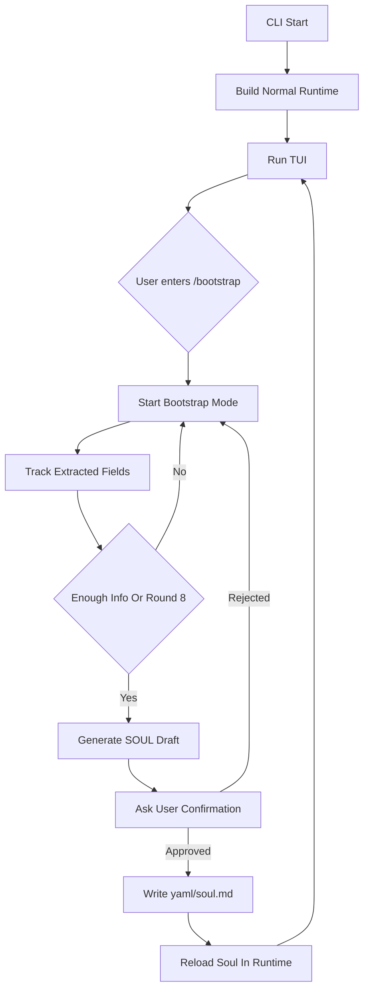

# DeerFlow 风格 soul.md Bootstrap - 产品 & 技术方案

> ⚠️ **OBSOLETE — 此方案已废弃**
>
> 后续决策(2026-05-15)取消了 `soul.md` 注入到 system prompt 的整条
> 链路。`yaml/soul.md` 不再被加载,与之配套的 `/bootstrap` slash
> command、`/reload` slash command、`Runtime.ReloadSoul`、
> `backend/cli/bootstrap/`、`backend/agent/soul_bootstrap*.go`、
> `backend/soulbootstrap/`、`backend/skills/public/bootstrap/` 全部已
> 删除。系统提示词由 `backend/agent/prompt.go` 静态生成,长期人格信息
> 改由 AGENTS.md(只注入 `<agent_discipline>` 段)和工作目录上下文承担。
>
> 本文档保留作为历史决策记录;不要按此方案实现。

> 日期: 2026-05-13
> 背景: CLI 需要一个显式入口生成或更新长期稳定的 agent persona。原方案是在首次启动且缺少 `RootDir/yaml/soul.md` 时自动进入 onboarding,但这会把功能限制在首启路径里。现在改为用户输入 `/bootstrap` 时启动 DeerFlow 风格 soul 生产逻辑: 通过 5-8 轮自适应 onboarding 会话采集信息,按固定模板生成草稿,用户确认后再写入 `soul.md`,之后构建 / 重建 system prompt 时注入。

---

## 0. 决策总览

参照 AGENTS.md:
- 配置仍然只用一个 `config.Config`,不新增 soul 子配置段。
- 结构体只装 onboarding 过程必须一起出现的状态;行为放顶层函数。
- `main` 不再阻塞式 bootstrap;`/bootstrap` 由 TUI slash command 触发。
- `yaml/config.yaml` 不改 shape,所以本需求不需要改 `yaml/CHANGELOG.md`。

| 项 | 决策 | 落点 |
|---|---|---|
| 触发时机 | 用户在 TUI 中输入 `/bootstrap` | `backend/cli/tui/commands.go` / `update.go` |
| 文件路径 | `filepath.Join(cfg.RootDir, "yaml", "soul.md")` | `bootstrap.getSoulPath` / `agent.loadSoulPrompt` |
| 已存在文件 | `/bootstrap` 仍可进入 onboarding,用于更新现有 `soul.md` | `bootstrap.LoadExistingSoul` |
| 缺文件流程 | 默认正常进入 TUI;用户输入 `/bootstrap` 后创建 | `handleBuiltin("/bootstrap")` |
| 采集方式 | 四阶段: Hello / You / Personality / Depth | `bootstrap.Session` |
| 生成方式 | 用 default model 根据会话和 extraction tracker 生成下一轮回复或 `SOUL.md` 草稿 | `agent.BuildSoulBootstrapReply` |
| 保存前确认 | 必须展示草稿并得到用户明确确认 | `submitBootstrap` / `isApproval` |
| 写入策略 | `yaml` 目录不存在就创建;临时文件 + rename 原子写 | `writeSoulFile` |
| prompt 注入 | 读取 `yaml/soul.md`,包成 `<soul>...</soul>` 替换 `{soul}` | `backend/agent/prompt.go` |
| 当前会话生效 | 保存后调用 runtime 的 `ReloadSoul` / `RebuildAgent`,不要替换整个 runtime | `backend/runtime/eino.Runtime` |
| git 策略 | `yaml/soul.md` 是本地人格 / 偏好文件,不入 git | `.gitignore` |
| 类型共享 | bootstrap 会话的纯数据类型放到独立包,避免 `agent` 和 `cli/bootstrap` 循环依赖 | `backend/soulbootstrap/types.go` |
| 不搬 DeerFlow 的部分 | 不搬 `setup_agent` tool / custom agents API / `agents/<name>` 目录 | 本仓库当前只有 default CLI agent |

---

## 1. 产品目标

### 1.1 目标体验

CLI 启动时不再自动进入 onboarding。用户需要创建或更新 persona 时,在 TUI 输入 `/bootstrap`:

```text
$ eino-cli

... 正常进入 TUI

> /bootstrap

Let's bootstrap your agent's SOUL.

Hello / 你好 / Hola / Bonjour.
What language should we use for this setup?
> 中文

好的,我们用中文。先聊你:你是谁?更重要的是,有什么事情你希望这个 agent 长期帮你接住?
> ...

...

Here is the first SOUL.md draft:

**Identity**
...

Does this feel right? Type yes to save, or tell me what to change.
> yes

Created yaml/soul.md
```

如果 `yaml/soul.md` 已存在,`/bootstrap` 作为更新入口:

```text
> /bootstrap

I found an existing yaml/soul.md. We'll update it instead of starting from zero.
What changed since this SOUL was written?
```

用户也可以直接编辑 `yaml/soul.md`;`/bootstrap` 是更自然的对话式创建 / 更新入口。

### 1.2 和原固定问卷的差异

| 原方案 | 新方案 |
|---|---|
| 一次性抛 5 个问题 | 5-8 轮自适应会话 |
| 用户像填表 | 像 DeerFlow bootstrap skill 一样自然对话 |
| 模型直接总结并写文件 | 模型先生成草稿,展示给用户确认 |
| 字段围绕个人信息 / 代码风格 / 禁忌 | 字段围绕 agent persona: identity / traits / communication / growth / lessons,并保留本仓库代码偏好和禁忌 |
| 无确认流程 | 未确认不写 `soul.md` |
| 只能首启触发 | 任意 TUI 会话中输入 `/bootstrap` 都可触发 |

### 1.3 四阶段 onboarding

搬 DeerFlow 的阶段设计,但落到 CLI 文本交互:

| Phase | 目标 | 关键提取字段 |
|---|---|---|
| Hello | 确定语言和第一印象 | preferredLanguage |
| You | 了解用户是谁、痛点是什么、agent 应该叫什么 | userName, userRole, painPoints, agentName, relationship |
| Personality | 定义 agent 如何行为和沟通 | coreTraits, communicationStyle, pushbackPreference, autonomyLevel, boundaries |
| Depth | 愿景、失败哲学、盲点和禁区 | failurePhilosophy, longTermVision, blindSpots, dealbreakers |

会话规则:
- 每轮最多 1-3 个问题。
- 不一次性倾倒所有问题。
- 用用户自己的词复述和确认。
- 用户回答很短时最多轻轻追问一次,不要逼问。
- 用户已经主动给全信息时可以合并阶段。
- 最多 8 轮;8 轮后仍缺字段则让模型基于已有上下文生成草稿并标注未明确的信息。

---

## 2. 数据流

```text
main.go / TUI
  ├─ os.Getwd()
  ├─ config.Load(root)
  ├─ config.SetLogLevel(cfg)
  ├─ eino.NewDeepAgentRuntime(ctx, cfg)
  └─ tui.Run(runtime)
       ├─ 用户输入 /bootstrap
       ├─ handleBuiltin("/bootstrap")
       ├─ startSoulBootstrapMode()
       │    ├─ load existing yaml/soul.md (optional)
       │    ├─ 维护 phase / round / conversation / extracted fields
       │    ├─ 每次用户提交都调用模型生成下一句回复或草稿
       │    ├─ 展示草稿并等待用户确认
       │    └─ 用户拒绝则继续对话修改
       ├─ writeSoulFile(path, draft)
       └─ rt.ReloadSoul(ctx) / rt.RebuildAgent(ctx)
```



关键点:
- **`/bootstrap` 是显式更新入口。** 启动不再因为缺 `soul.md` 卡住;没有 soul 时正常运行,直到用户主动 bootstrap。
- **保存后要让新 soul 生效。** deep agent 的 `Instruction` 在 agent 构建时固定;`/bootstrap` 保存文件后调用 runtime 的 `ReloadSoul` / `RebuildAgent`,由 runtime 内部重建 lead agent / runner。TUI 不替换整个 runtime。
- **bootstrap 模型不能走当前 deep agent。** 当前 deep agent 可能还没加载新 soul,也带 tools / memory / middleware。bootstrap 只需要普通 chat model 调 `Generate`。
- **prompt 注入只读文件。** 不把 soul 内容塞进 `Config` 字段,避免让配置结构承担文档缓存职责。

---

## 3. `soul.md` 文件格式

采用 DeerFlow `SOUL.template.md` 的核心结构,再加入本仓库明确需要的代码风格和禁忌字段。

最终文件示例:

```md
**Identity**

[AI Name] - [User Name]'s [relationship framing], not [contrast]. Goal: [long-term aspiration]. Handle [specific domains from pain points] so [User Name] focuses on [what matters to them].

**Core Traits**

[Trait 1 - behavioral rule derived from conversation].
[Trait 2 - behavioral rule].
[Trait 3 - behavioral rule].
[Trait 4 - failure handling rule: allowed to fail, forbidden to repeat].

**Communication**

[Tone description matching the user]. Default language: [language]. [Language-switching rules if any].

**Code Style**

[Concrete coding preferences: structure, naming, tests, comments, risk tolerance.]

**Growth**

Learn [User Name] through every conversation - thinking patterns, preferences, blind spots, aspirations. Over time, anticipate needs and act on [User Name]'s behalf with increasing accuracy. Early stage: proactively ask casual/personal questions after tasks to deepen understanding of who [User Name] is. Full of curiosity, willing to explore.

**Never Do**

[Hard prohibitions, destructive-operation rules, files or workflows to avoid.]

**Lessons Learned**

_(Mistakes and insights recorded here to avoid repeating them.)_
```

### 3.1 生成规则

搬 DeerFlow 的硬规则:
- 最终 `SOUL.md` 默认用英文写,即使 onboarding 会话使用中文。原因是 system prompt 主体是英文,混排更稳定。这个点保留在待讨论里。
- 每句话都必须能追溯到用户说过或强烈暗示过的内容,禁止 generic filler。
- `Core Traits` 必须是行为规则,不是形容词。例如写 "challenge assumptions before acting",不要写 "proactive and brave"。
- 总长度控制在 300 words 左右。密度优先,不要散文。
- `Growth` 段固定保留,只替换用户名。
- `Lessons Learned` 初始为空占位,为后续“错误不重复”留位置。

本仓库新增规则:
- `Code Style` 必须总结用户对代码结构、命名、测试、注释、风险控制的偏好。
- `Never Do` 必须保留硬禁令,尤其是 destructive git、secret、配置文件等约束。
- 不把 API key、token、私密凭据写进 `soul.md`。如果用户说出 secret,生成时要概括为“不要泄露或写入凭据”,不保留原文。

### 3.2 prompt 注入形态

注入到 system prompt 时完整包成:

```xml
<soul>
**Identity**
...
</soul>
```

如果文件不存在、读取失败、trim 后为空,`loadSoulPrompt` 返回空字符串。prompt 构建阶段不报错,避免没有执行 `/bootstrap` 的用户无法启动。

---

## 4. 实现方案

### 4.1 `main.go` 不接入 bootstrap

`main` 保持正常启动流程,不再因为缺 `soul.md` 阻塞:

```go
func main() {
	ctx := context.Background()

	root, err := os.Getwd()
	if err != nil {
		log.Fatalf("get root: %v", err)
	}

	cfg, err := config.Load(root)
	if err != nil {
		log.Fatalf("load config: %v", err)
	}

	config.SetLogLevel(cfg)

	runtime, err := eino.NewDeepAgentRuntime(ctx, cfg)
	if err != nil {
		log.Fatalf("build runtime: %v", err)
	}

	if err := tui.Run(runtime); err != nil {
		os.Exit(1)
	}
}
```

### 4.2 slash command 接入

`backend/cli/tui/commands.go` 增加 `/bootstrap`:

```go
var commands = []slashCommand{
	{Name: "bootstrap", Desc: "create or update yaml/soul.md through onboarding"},
	{Name: "clear", Desc: "clear the in-memory conversation history"},
	...
}
```

`backend/cli/tui/update.go::handleBuiltin` 分发:

```go
case "bootstrap":
	return m.handleBootstrapCmd(), true
}
```

`handleBootstrapCmd` 把 TUI 切进 bootstrap mode,不走普通 runtime stream:

```go
func (m *Model) handleBootstrapCmd() tea.Cmd {
	if m.streaming {
		m.pushMessage("system", "finish or cancel the current response before /bootstrap")
		return nil
	}
	session, err := bootstrap.NewSession(m.cfg)
	if err != nil {
		m.pushMessage("system", fmt.Sprintf("bootstrap: %v", err))
		return nil
	}
	m.bootstrap = session
	m.pushMessage("system", "Starting SOUL bootstrap. Type /cancel to abort.")
	return m.nextBootstrapReply("")
}
```

`Model` 只调用 runtime 暴露的 reload 能力,不持有 runtime factory:

```go
type Model struct {
	rt eino.Runtime
	cfg *config.Config
	bootstrap *bootstrap.Session
	...
}
```

输出规则:
- bootstrap 问题、草稿、确认提示作为 `system` / `assistant` message 进入 scrollback。
- 不额外打 `slog.Info`;运行期诊断仍按仓库习惯用 `slog.Warn` / `slog.Debug`。
- 错误通过 system message 展示,不退出 TUI。

### 4.3 `backend/cli/bootstrap/soul.go`

bootstrap 包提供可被 TUI 每次 submit 驱动的 session,不直接读 `os.Stdin` / 写 `os.Stdout`:

```go
type Session struct {
	path  string
	state soulbootstrap.State
}

func NewSession(cfg *config.Config) (*Session, error) {
	path := getSoulPath(cfg)
	existing, err := loadExistingSoul(path)
	if err != nil {
		return nil, err
	}
	return &Session{
		path: path,
		state: soulbootstrap.State{
			Phase: soulbootstrap.PhaseHello,
			ExistingSoul: existing,
		},
	}, nil
}

func (s *Session) Next(ctx context.Context, cfg *config.Config, userInput string) (soulbootstrap.Reply, error) {
	if strings.TrimSpace(userInput) != "" {
		s.state.Conversation = append(s.state.Conversation, soulbootstrap.Turn{
			Role: "user", Content: strings.TrimSpace(userInput),
		})
	}
	reply, err := agent.BuildSoulBootstrapReply(ctx, cfg, s.state)
	if err != nil {
		return soulbootstrap.Reply{}, err
	}
	s.state.Fields = reply.Fields
	s.state.Phase = reply.NextPhase
	s.state.Round++
	if reply.Draft != "" {
		s.state.Draft = reply.Draft
	}
	return reply, nil
}

func (s *Session) Save() error {
	return writeSoulFile(s.path, s.state.Draft)
}
```

`loadExistingSoul` 返回空字符串表示从零创建;有内容表示本次是 update,模型 prompt 需要基于现有 soul 做修改,不要丢掉用户未提及的旧设定。

### 4.4 `backend/soulbootstrap/types.go`

纯数据类型放在独立包,避免 `agent` 包为了复用 `buildChatModel` 又反向 import `cli/bootstrap`。

结构体只保存多轮会话必须一起出现的状态:

```go
package soulbootstrap

type State struct {
	Phase        Phase
	Round        int
	Conversation []Turn
	Fields       Fields
	Draft        string
	ExistingSoul string
}

type Phase string

const (
	PhaseHello       Phase = "hello"
	PhaseYou         Phase = "you"
	PhasePersonality Phase = "personality"
	PhaseDepth       Phase = "depth"
	PhaseDraft       Phase = "draft"
)

type Turn struct {
	Role    string
	Content string
}

type Fields struct {
	PreferredLanguage  string `json:"preferred_language"`
	UserName           string `json:"user_name"`
	UserRole           string `json:"user_role"`
	PainPoints         string `json:"pain_points"`
	AgentName          string `json:"agent_name"`
	Relationship       string `json:"relationship"`
	CoreTraits         string `json:"core_traits"`
	CommunicationStyle string `json:"communication_style"`
	PushbackPreference string `json:"pushback_preference"`
	AutonomyLevel      string `json:"autonomy_level"`
	FailurePhilosophy  string `json:"failure_philosophy"`
	LongTermVision     string `json:"long_term_vision"`
	BlindSpots         string `json:"blind_spots"`
	Boundaries         string `json:"boundaries"`
	CodeStyle          string `json:"code_style"`
	NeverDo            string `json:"never_do"`
}

type Reply struct {
	Message   string `json:"message"`
	NextPhase Phase  `json:"next_phase"`
	Fields    Fields `json:"fields"`
	Draft     string `json:"draft"`
	Ready     bool   `json:"ready"`
}
```

理由:
- `Fields` 是 extraction tracker,对应 DeerFlow bootstrap skill 的 required / nice-to-have 字段。
- `CodeStyle` 和 `NeverDo` 是本仓库首要需求,不藏在 generic boundaries 里。
- 不为每个 phase 单独建策略对象,避免过度抽象。

### 4.5 TUI submit 分流

```go
func (m *Model) submit(text string) (tea.Model, tea.Cmd) {
	if m.bootstrap != nil {
		return m.submitBootstrap(text)
	}
	if cmd, handled := m.handleBuiltin(text); handled {
		return m, cmd
	}
	...
}
```

`submitBootstrap` 解释确认 / 取消 / 普通回答:

```go
func (m *Model) submitBootstrap(text string) (tea.Model, tea.Cmd) {
	trimmed := strings.TrimSpace(text)
	if strings.EqualFold(trimmed, "/cancel") {
		m.bootstrap = nil
		m.pushMessage("system", "SOUL bootstrap cancelled")
		return m, nil
	}
	if m.bootstrap.HasDraft() && isApproval(trimmed) {
		return m, m.saveBootstrapDraft()
	}
	m.pushMessage("user", text)
	return m, m.nextBootstrapReply(text)
}
```

`BuildSoulBootstrapReply` 放在 `agent` 包,因为它复用 `buildChatModel`。`bootstrap` 包只负责 session 状态和写文件,TUI 负责渲染。

### 4.6 模型输出协议

模型每轮返回 JSON,CLI 只根据结构执行,不解析自然语言:

```go
// See soulbootstrap.Reply in backend/soulbootstrap/types.go.
```

规则:
- `message` 是要展示给用户的下一轮回复或草稿引导语。
- `fields` 是当前 extraction tracker 的完整快照。
- `ready=false` 时 `draft` 必须为空。
- `ready=true` 时 `draft` 必须是完整 `SOUL.md`。
- 第 8 轮后必须 `ready=true`,即使字段不完整,也基于已有信息生成草稿。

### 4.7 `agent.BuildSoulBootstrapReply`

```go
func BuildSoulBootstrapReply(
	ctx context.Context,
	cfg *config.Config,
	state soulbootstrap.State,
) (soulbootstrap.Reply, error) {
	chatModel, err := buildChatModel(ctx, cfg.Models[cfg.DefaultModel])
	if err != nil {
		return soulbootstrap.Reply{}, fmt.Errorf("build soul bootstrap model: %w", err)
	}
	return buildSoulBootstrapReplyWithModel(ctx, chatModel, state)
}
```

依赖方向:

```text
cli/bootstrap -> soulbootstrap
agent         -> soulbootstrap
```

`BuildSoulBootstrapReply` 的 prompt 要包含:
- DeerFlow bootstrap `Ground Rules`。
- 四阶段 `Conversation Phases`。
- extraction tracker。
- `ExistingSoul` 内容;如果存在,本轮是 update,不是从零创建。
- `SOUL.template.md`。
- 本仓库新增的 `Code Style` / `Never Do` 要求。
- 严格 JSON 输出要求。

### 4.8 runtime reload 能力

保存 `yaml/soul.md` 后,当前 deep agent 的 system prompt 仍是旧的。不要让 TUI 创建一个新 runtime;应该把重建 agent 的能力收进 runtime 自己:

```go
type Runtime interface {
	Execute(ctx context.Context, prompt string) (Result, error)
	ExecuteStream(ctx context.Context, prompt string, onChunk StreamChunkHandler) (Result, error)
	ClearHistory()
	ReloadSoul(ctx context.Context) error
	Name() string
}
```

`ReloadSoul` 的职责:
- 重新调用 `agent.MakeLeadAgent(ctx, "default", false, true, cfg)`。
- 用新 lead agent 构造新的 `adk.Runner`。
- 在 runtime mutex 下替换 `runner` / `trace`。
- 清空或重置当前 history,避免旧 system prompt 对话继续污染新 persona。
- 保留同一个 `DeepAgentRuntime` 实例,所以 TUI 的 `m.rt` 不需要替换。

如果未来需要表达更通用的能力,也可以命名为 `RebuildAgent(ctx)`;本需求语义上首选 `ReloadSoul(ctx)`。

TUI 保存草稿后只调用 runtime 方法:

```go
func (m *Model) saveBootstrapDraft() tea.Cmd {
	return func() tea.Msg {
		if err := m.bootstrap.Save(); err != nil {
			return bootstrapSavedMsg{err: err}
		}
		if err := m.rt.ReloadSoul(context.Background()); err != nil {
			return bootstrapSavedMsg{err: err}
		}
		return bootstrapSavedMsg{}
	}
}
```

收到成功消息后:
- `m.bootstrap = nil`
- `m.messages = freshMessages(...)`
- `m.rebuildHistory()`
- push system message: `SOUL saved and reloaded`

### 4.9 prompt 注入

保留简单读取:

```go
func loadSoulPrompt(cfg *config.Config) string {
	data, err := os.ReadFile(filepath.Join(cfg.RootDir, "yaml", "soul.md"))
	if err != nil {
		return ""
	}
	body := strings.TrimSpace(string(data))
	if body == "" {
		return ""
	}
	return "<soul>\n" + body + "\n</soul>"
}
```

`GetSystemPrompt` 里把 `{soul}` 从空字符串替换为 `loadSoulPrompt(cfg)`。

---

## 5. 错误处理

| 场景 | 行为 |
|---|---|
| `yaml/soul.md` 不存在 | 启动不报错;用户输入 `/bootstrap` 后从零创建 |
| `yaml/soul.md` 已存在 | `/bootstrap` 读取旧内容并进入 update flow |
| `os.Stat` / 读取旧 soul 权限错误 | TUI system message 展示错误,不进入 bootstrap mode |
| 用户输入 `/cancel` | 退出 bootstrap mode,不写文件 |
| 用户回答空 | 记录 `(not specified)`,继续推进 |
| 超过 8 轮仍缺字段 | 模型必须基于已有信息生成草稿,缺失处不要编造具体事实 |
| 模型返回非法 JSON | system message 展示错误,保留 bootstrap mode 允许用户重试或 `/cancel` |
| 模型返回空 draft 但 ready=true | system message 展示错误,不写文件 |
| 用户拒绝草稿并给反馈 | 把反馈加入 conversation,继续生成新版草稿 |
| 用户反复拒绝 | 不设硬次数;仍受整体 8 轮采集限制,草稿迭代可继续直到用户 Ctrl+C |
| 写文件失败 | system message 展示错误,保留 bootstrap mode |
| `ReloadSoul` 失败 | soul 已保存;提示用户重启 CLI 让新 soul 生效 |
| 后续 prompt 读取失败 | 不注入,继续启动 |

不做的事:
- 不自动把原始问答写入 `soul.md` 当 fallback。
- 不引入 `soul.enabled` 配置。用户想禁用时删 / 清空 `soul.md` 即可。
- 不在启动时自动 bootstrap。用户必须显式输入 `/bootstrap`。
- 不搬 DeerFlow custom agent 管理 API。
- 不在本轮实现 `Lessons Learned` 自动更新。

---

## 6. 测试计划

### 6.1 bootstrap 包测试

新增 `backend/cli/bootstrap/soul_test.go`:
- `NewSession` 在 `soul.md` 不存在时创建空 `ExistingSoul`。
- `NewSession` 在 `soul.md` 已存在时把旧内容放进 `ExistingSoul`。
- `Session.Next` 会把用户输入加入 conversation 并更新 fields / phase / draft。
- 用户拒绝第一版草稿并给反馈后,继续生成第二版。
- 模型错误时不写文件。
- `writeSoulFile` 会创建 `yaml` 目录,并使用 temp + rename。

为避免测试打真实模型,保留包级注入点:

```go
var buildSoulBootstrapReply = agent.BuildSoulBootstrapReply
```

### 6.2 TUI 命令测试

新增 / 修改 `backend/cli/tui` 测试:
- `commands` 包含 `/bootstrap`,popup 能检索到。
- `/help` 提到 `/bootstrap`。
- `handleBuiltin("/bootstrap")` 进入 bootstrap mode,不调用普通 runtime stream。
- bootstrap mode 下普通输入走 `submitBootstrap`,不发给 runtime。
- `/cancel` 退出 bootstrap mode。
- 用户确认草稿后写入 `yaml/soul.md`,调用 `rt.ReloadSoul`,并清空历史。
- `ReloadSoul` 失败时显示 system message,提示重启后生效。

### 6.3 runtime 测试

新增 / 修改 `backend/runtime/eino` 测试:
- `Runtime` 接口包含 `ReloadSoul(ctx)`。
- `DeepAgentRuntime.ReloadSoul` 重新构造 lead agent / runner,但不替换 runtime 实例。
- `ReloadSoul` 后清空 history,并重置 trace turn。
- `ReloadSoul` 返回错误时保留旧 runner,避免当前会话被破坏。

### 6.4 agent 包测试

新增 `backend/agent/soul_bootstrap_test.go`:
- prompt 包含 DeerFlow 四阶段规则。
- prompt 包含 SOUL template。
- prompt 包含 `Code Style` / `Never Do`。
- `parseSoulBootstrapReply` 能解析合法 JSON。
- 非法 JSON / 空 draft / ready 与 draft 不一致时返回错误。
- 第 8 轮时 prompt 明确要求生成草稿。
- state 带 `ExistingSoul` 时,prompt 明确要求 update 而不是从零覆盖。

### 6.5 prompt 注入测试

新增 / 修改 `backend/agent/prompt_test.go`:
- `loadSoulPrompt` 缺文件返回空。
- 空文件返回空。
- 有内容时包成 `<soul>...</soul>`。
- `GetSystemPrompt` 包含 soul block。

### 6.6 手工验证

```sh
rm -f yaml/soul.md
go run .
```

预期:
- CLI 正常进入 TUI,不会自动 bootstrap。
- 输入 `/bootstrap` 后进入多轮 onboarding。
- 生成草稿后要求确认。
- 输入 `yes` 后创建 `yaml/soul.md`。
- 当前 runtime 调用 `ReloadSoul`,新 soul 对后续对话生效。

更新验证:

```sh
go run .
```

预期:
- 输入 `/bootstrap` 后提示发现已有 `yaml/soul.md`。
- 新草稿基于旧 soul 修改,不是从零覆盖。

再跑:

```sh
go test ./backend/cli/bootstrap ./backend/agent
```

确认 `.gitignore` 包含:

```gitignore
/yaml/soul.md
```

---

## 7. 待讨论

1. 最终 `SOUL.md` 是否强制英文? DeerFlow 强制英文;本仓库 system prompt 也是英文为主,建议照搬。
2. reload 方法命名用 `ReloadSoul(ctx)` 还是 `RebuildAgent(ctx)`? 建议先用 `ReloadSoul(ctx)`,因为触发源明确是 soul 文件更新;未来如果还有模型 / tool 配置热更新,再扩成 `RebuildAgent(ctx)`。
3. 是否拆 `USER.md` 和 `SOUL.md`? DeerFlow 路径设计里有 `USER.md` 全局用户画像和 `SOUL.md` agent persona。本轮建议不拆,先把用户信息和 agent persona 都收敛到 `yaml/soul.md`;后续 memory 稳定后再讨论拆分。
4. 草稿拒绝后是否设置最大重试次数? 建议不设,让用户 `/cancel` 退出;因为这是用户显式触发的配置流程,不应因为次数限制写入用户不满意的 persona。
