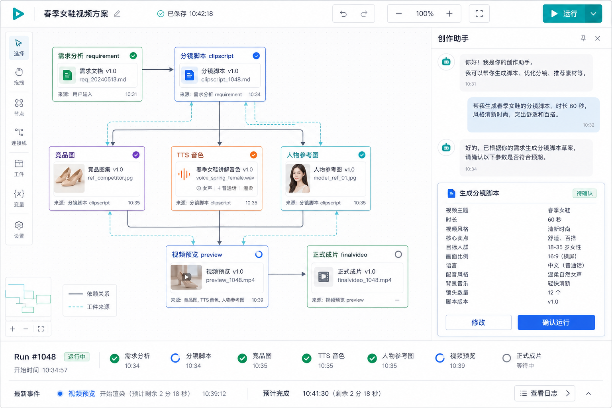

# Canvas Video Agent 技术方案

状态：现行方案。本文是 Canvas Agent 一期方案和本地视频执行器方案的唯一合并版本。`/Users/bytedance/go/src/content/creative_aic_agent/canvas_agent/TECHNICAL_DESIGN.md` 仅保留为一期资源准备阶段的历史档案，不再作为实现依据。

## 1. 目标与边界

系统让用户在画布上查看、编辑并运行视频生产流程。每次运行固化当时的工作流版本；产物之间的依赖关系由 `Artifact.ParentIDs` 表示，前端据此绘制来源连线。

```text
Canvas Project + WorkflowVersion
        |
        +-> Agent: 理解用户意图，提出画布或运行操作
        |
        +-> DAG Runner: 执行已确认的工作流，恢复异步节点
```

本期提供一个可运行的内置视频模板，从需求分析走到 `finalvideo`。模板中的模型、图片、TTS 和视频能力由 Agent 服务直接调用底层 SDK；不调用 Mega 的 `BatchSaveClipScript`、`GenPictureClipCandidates`、`MixCutByClipScript` 工作流接口，也不迁移 Mega 的 Task、SubTask、ASL、FSM、配额或审核编排壳。

本地模式用 JSON 文件替代数据库、进程内队列替代 MQ。生产模式仅替换能力 Client 和回调接入，DAG、Run、节点状态和恢复规则不变。

## 2. Canvas、Agent 与 DAG 的边界

| 层 | 负责什么 | 不负责什么 |
|---|---|---|
| Canvas | 编辑节点和连线，展示 Run、节点状态、Artifact 来源 | 不直接调用模型或生成服务 |
| Agent / ReAct | 将用户请求转换为画布操作、参数修改、运行或重试建议 | 不推进异步任务，不决定节点是否可运行 |
| DAG Runner | 按依赖领取节点、持久化提交、处理回调/轮询、生成 Artifact | 不理解自然语言，不修改未确认的工作流 |
| Node Client | 调用模型、图片、TTS、视频等原子能力 | 不保存 DAG 状态，不创建下游节点 |

Agent 可以提出 `add_node`、`connect`、`update_input`、`run`、`retry` 等 Action；画布确认后生成新的 `WorkflowVersion`。Runner 永远只执行 Run 内嵌的不可变版本。因此 Agent 的 ReAct loop 与 DAG 不嵌套：前者负责决策，后者负责确定性编排、持久化和恢复。

## 3. 页面与运行模型



实线表示工作流依赖；Artifact 来源线以 `ParentIDs` 为准。例如某个预览视频同时连到 `clipscript`、竞品图、TTS 和人物参考图，`finalvideo` 连到它采用的预览视频。这样画布能回答“这个视频来自哪段分镜和哪些原料”，而不是只展示平铺卡片。

Canvas 服务拥有 Project 和可编辑的 WorkflowVersion；执行器只接收 `ProjectID` 和一份不可变的 WorkflowVersion 快照：

```go
type Workflow struct {
	Nodes []WorkflowNode `json:"nodes"`
	Edges []WorkflowEdge `json:"edges"`
}

type WorkflowVersion struct {
	ID        string `json:"workflow_version_id"`
	ProjectID string `json:"project_id"`
	Revision  int    `json:"revision"`
	Workflow
}

type Run struct {
	ID        string          `json:"run_id"`
	ProjectID string          `json:"project_id"`
	Workflow  WorkflowVersion `json:"workflow"`
	Input     RunInput        `json:"input"`
	NodeRuns  []NodeRun       `json:"node_runs"`
}
```

当前本地代码已实现 Run 快照、内置模板和自定义 Workflow 校验入口；Canvas Project API、界面编辑器和 Agent Action 仍在后续接入，不伪装成已完成能力。

### 3.1 右侧会话与确认操作

右侧对话不是 Canvas 节点的一部分。`Message` 保存用户和 Agent 可见的内容；`CanvasOperation` 保存 Agent 提出的、会改变画布或 Run 的实际操作。两者通过 `MessagePart` 关联：一条 Agent 消息既可以有普通文字，也可以引用一个产物和一个待确认操作。

```go
type Conversation struct {
	ID        string    `json:"conversation_id"`
	ProjectID string    `json:"project_id"`
	CreatedAt time.Time `json:"created_at"`
}

type Message struct {
	ID             string        `json:"message_id"`
	ConversationID string        `json:"conversation_id"`
	Role           string        `json:"role"` // user / assistant / system
	Parts          []MessagePart `json:"parts"`
	CreatedAt      time.Time     `json:"created_at"`
}

type MessagePart struct {
	Type        string `json:"type"` // text / artifact / operation
	Text        string `json:"text,omitempty"`
	ArtifactID  string `json:"artifact_id,omitempty"`
	OperationID string `json:"operation_id,omitempty"`
}

type CanvasOperation struct {
	ID              string          `json:"operation_id"`
	ProjectID       string          `json:"project_id"`
	RunID           string          `json:"run_id,omitempty"`
	SourceMessageID string          `json:"source_message_id"`
	Type            string          `json:"type"` // update_node / connect / run / retry
	TargetNodeID    string          `json:"target_node_id,omitempty"`
	Payload         json.RawMessage `json:"payload"`
	Status          string          `json:"status"` // pending / confirmed / applied / rejected
	CreatedAt       time.Time       `json:"created_at"`
}
```

```text
Conversation
  -> Message("已生成 clipscript，请确认运行预览")
       -> MessagePart{text}
       -> MessagePart{artifact: clipscript-v1}
       -> MessagePart{operation: run-preview-001}
  -> CanvasOperation{type: run, target: preview, status: pending}
```

规则如下：

1. 普通问答、解释和运行进度只创建 `Message`，不创建 `CanvasOperation`。
2. Agent 提议修改节点、连线、输入，或运行/重试某个节点时，先持久化 `CanvasOperation{Status: pending}`，再把它引用到 Agent 消息中。
3. 用户确认后，服务原子地把 Operation 标记为 `confirmed`，执行对应画布修改或创建 Run；成功后标记为 `applied`，拒绝则为 `rejected`。
4. 画布修改产生新的 `WorkflowVersion`；`run` / `retry` 只作用于指定 Run 或新建 Run，不能修改已运行版本。
5. SSE 的 token/delta 仅用于实时显示；持久化的是完成后的 `Message` 和 `CanvasOperation`，避免把传输分片当成业务对象。

`Conversation` 不内嵌 `[]Message`，消息按 `ConversationID + CreatedAt` 独立分页查询。`CanvasOperation` 也不附着在 Message 的 JSON 中，因为它需要独立的确认、审计、幂等和重试状态。

## 4. 内置 VideoWorkflow 模板

`VideoWorkflow` 是默认模板，不是整个 Canvas 产品的同义词：

```text
requirement -> clipscript -> competition --+
                           -> tts ---------+-> preview -> finalvideo
                           -> character ---+
```

```go
func VideoWorkflow() Workflow {
	return Workflow{
		Nodes: []WorkflowNode{
			{ID: "requirement", Kind: RequirementNode},
			{ID: "clipscript", Kind: ClipScriptNode},
			{ID: "competition", Kind: CompetitionReferenceNode},
			{ID: "tts", Kind: PromptTTSNode},
			{ID: "character_reference", Kind: CharacterReferenceNode},
			{ID: "preview", Kind: PreviewNode},
			{ID: "finalvideo", Kind: FinalVideoNode},
		},
		Edges: []WorkflowEdge{
			{FromNodeID: "requirement", FromPort: "requirement", ToNodeID: "clipscript", ToPort: "requirement"},
			{FromNodeID: "clipscript", FromPort: "clipscript", ToNodeID: "competition", ToPort: "clipscript"},
			{FromNodeID: "clipscript", FromPort: "clipscript", ToNodeID: "tts", ToPort: "clipscript"},
			{FromNodeID: "clipscript", FromPort: "clipscript", ToNodeID: "character_reference", ToPort: "clipscript"},
			{FromNodeID: "clipscript", FromPort: "clipscript", ToNodeID: "preview", ToPort: "clipscript"},
			{FromNodeID: "competition", FromPort: "competition_reference_image", ToNodeID: "preview", ToPort: "resources"},
			{FromNodeID: "tts", FromPort: "voice_preview", ToNodeID: "preview", ToPort: "resources"},
			{FromNodeID: "character_reference", FromPort: "character_reference_image", ToNodeID: "preview", ToPort: "resources"},
			{FromNodeID: "preview", FromPort: "preview_video", ToNodeID: "finalvideo", ToPort: "preview_video"},
		},
	}
}
```

节点目录由后端注册，用户只保存节点实例和参数，不保存可执行代码：

```go
type PortDefinition struct {
	Name         string
	ArtifactKind string
	Required     bool
}

type NodeDefinition struct {
	Kind    NodeKind
	Inputs  []PortDefinition
	Outputs []PortDefinition
}
```

开始运行时，Runner 接收用户编辑后的 `Workflow`，先按节点目录校验节点类型、端口类型、重复连线和环路，再复制成 `WorkflowVersion` 写入 Run。`POST /runs` 不传 `workflow` 时使用 `VideoWorkflow()`；传入时执行用户提交的图。当前执行器已经支持节点布局和自定义节点 ID，具体节点种类仍必须来自后端注册目录。

节点状态只使用 `pending`、`running`、`waiting`、`succeeded`、`failed`。资源控制节点的子任务允许部分失败：全部子任务终态后，控制节点记为 `succeeded`；失败资源保留失败 Artifact，但不阻塞预览。`requirement`、`clipscript`、`preview` 与 `finalvideo` 自身失败则使对应节点失败。

## 5. 节点输入、产物与原子能力

| 节点 | 直接能力 | 成功产物 | 关键规则 |
|---|---|---|---|
| `requirement` | Fornax `aic.aic_tool.user_req_analysis` | `requirement` | 输出目标、受众、卖点 |
| `clipscript` | 当前租户的分镜 Prompt；即创端到端为 `jichuang.creative.dr_script_e2e` | `clipscript` | 输出镜头、旁白、画面描述 |
| `competition_reference_image` | Fornax 规划 + `remote.Text2Image` | 图片和 `clipscript_annotation` | 镜头改写必须是独立 Artifact，不覆盖 clipscript |
| `prompt_tts` | Fornax 规划 + `remote.TTS(Async=true, WithExample=true)` | 音频 | 直接复用回调的 `example_uri` 作为预览音频 |
| `character_reference_image` | AIGCPlanning + `remote.Text2Image` | 审核通过的参考图 | 提示词审核、图片审核，允许一次模型 fallback |
| `preview` | 底层视频候选/预览能力 | `preview_video` | 读取 clipscript 和所有成功资源 |
| `finalvideo` | 底层正式视频生成能力 | `finalvideo` | 以指定预览视频为父产物 |

`clipscript` 是不可变版本产物。资源计划保存真实 `ParentArtifactID`，预览和 `finalvideo` 保存所有实际输入的 Artifact ID：

```go
type Artifact struct {
	ID        string          `json:"artifact_id"`
	Kind      string          `json:"kind"`
	Status    string          `json:"status"`
	ParentIDs []string        `json:"parent_ids,omitempty"`
	Data      json.RawMessage `json:"data,omitempty"`
	Message   string          `json:"message,omitempty"`
}
```

因此产物关系来自真实输入，而不是前端根据节点名称猜测：竞品图/TTS/人物图可追溯到 `clipscript`，预览可追溯到这批资源，`finalvideo` 可追溯到预览。

## 6. 可恢复异步执行

Runner 只有四个动作：创建 Run、推进就绪节点、刷新等待节点、处理回调。

```text
StartRun -> Advance
Advance  -> 领取 ready NodeRun -> 同步完成，或提交异步 Job 后 waiting
Callback -> 按 provider + job_id 找到 NodeRun -> Refresh -> Advance
Poll     -> 按 submit_key 对账 -> 刷新所有 waiting Job -> Advance
```

`NodeRun.SubmitKey` 在提交前持久化。提交超时或进程崩溃后，必须按该 key 查询已有 Job，禁止盲目重提：

```go
type NodeRun struct {
	NodeID            string    `json:"node_id"`
	Kind              NodeKind  `json:"kind"`
	InstanceKey       string    `json:"instance_key,omitempty"`
	State             NodeState `json:"state"`
	Provider          string    `json:"provider,omitempty"`
	JobID             string    `json:"job_id,omitempty"`
	SubmitKey         string    `json:"submit_key"`
	Artifacts         []Artifact `json:"artifacts,omitempty"`
	FallbackSubmitted bool      `json:"fallback_submitted,omitempty"`
	Message           string    `json:"message,omitempty"`
}
```

恢复规则：

1. 提交异常或 `FindBySubmitKey` 暂时异常，节点维持 `waiting`，下一次继续对账。
2. 重启时同步 `running` 节点回到 `pending`；异步 `running` 节点回到 `waiting`，仅查询既有 `job_id` 或 `submit_key`。
3. 回调以 `provider:event_id` 去重。回调早于 `job_id` 持久化时进入 inbox；后续保存 Job 时消费 inbox，再执行刷新。
4. 人物参考图的 fallback 先保存 `FallbackSubmitted=true`，再在下一次推进时提交，因此最多提交一次。
5. Webhook/EventBus consumer 只做鉴权、持久化和调度；不能在回调线程调用模型或再次提交任务。

## 7. Client 契约与生产替换

编排层只依赖能力接口，不知道 Mega：

```go
type Planner interface {
	AnalyzeRequirement(context.Context, RunInput) (Requirement, error)
	CreateClipScript(context.Context, Requirement) (ClipScript, error)
	PlanCompetition(context.Context, ClipScript, RunInput) ([]ResourcePlan, error)
	PlanTTS(context.Context, ClipScript) ([]ResourcePlan, error)
	PlanCharacterReferences(context.Context, ClipScript, RunInput) ([]ResourcePlan, error)
}

type VideoClient interface {
	SubmitPreview(context.Context, VideoRequest) (SubmittedJob, error)
	GetPreview(context.Context, string) (JobStatus, error)
	FindPreviewBySubmitKey(context.Context, string) (SubmittedJob, bool, error)

	SubmitFinalVideo(context.Context, VideoRequest) (SubmittedJob, error)
	GetFinalVideo(context.Context, string) (JobStatus, error)
	FindFinalVideoBySubmitKey(context.Context, string) (SubmittedJob, bool, error)
}
```

生产 Adapter 的职责是协议转换：Fornax Adapter 读取 Prompt、填充变量并输出领域结构；Image/TTS/Video Adapter 直接调用对应底层 SDK，传入 Agent 自己的 `BizId`、回调身份和 `submit_key`。它们不得转调 Mega 工作流接口。

上线前必须取得并验证：Agent 的 `BizId`、回调 Topic/Endpoint 和验签身份、按 `job_id` 查询终态的接口、按 `submit_key` 查询已提交任务的接口，以及取消契约。缺失任一项时生产 Client 不应启用。

## 8. 当前本地实现

代码位于 LLM 仓库，提供一条独立可启动的模板执行链路：

| 文件 | 责任 |
|---|---|
| `backend/videoagent/types.go` | VideoWorkflow、Run、Artifact、节点类型 |
| `backend/videoagent/workflow.go` | 节点目录、端口校验、环路校验和 Workflow 快照复制 |
| `backend/videoagent/runner.go` | Start、Advance、Poll、Callback |
| `backend/videoagent/handler.go` | 需求、clipscript、资源、预览、finalvideo 节点 |
| `backend/videoagent/store.go` | `workflow.json`、回调 inbox、幂等收据 |
| `backend/videoagent/local.go` | 本地 Job 库、队列及确定性 Client |
| `backend/videoagent/http.go` | 本地 HTTP API |
| `backend/videoagent/workflow_test.go` | 非法端口、环路和自定义 Workflow 快照测试 |
| `cmd/videoagent/main.go` | 可启动入口 |

```bash
GOTOOLCHAIN=auto go run ./cmd/videoagent \
  -addr 127.0.0.1:18080 -data /tmp/video-agent
```

```text
POST /runs
GET  /runs/{run_id}
POST /runs/{run_id}/poll
GET  /healthz
GET  /workflow/node-definitions
```

本地实现使用 `LocalClients` 和进程内队列，模拟持久化、回调、轮询、提交不确定和 TTS example 音频复用；它不是生产 Client，也没有实现 Canvas UI 或 Agent ReAct。

## 9. 验收、发布与回滚

验收必须覆盖：

1. 创建 Run 后存在 `requirement`、`clipscript`、`preview_video`、`finalvideo` Artifact。
2. `preview_video.ParentIDs` 包含 `clipscript` 和成功资源；`finalvideo.ParentIDs` 包含所选预览。
3. TTS 只提交一次 `Async=true, WithExample=true`；`preview_audio_uri` 等于回调 example URI。
4. 重复 callback 不重复创建 Artifact；重启后 pending Job 可恢复且 `submit_key` 不重复提交。
5. 单个资源失败不会阻塞预览；预览或 `finalvideo` 失败在对应节点可见。
6. Canvas 修改产生新 WorkflowVersion，旧 Run 仍按快照执行；Agent 不可绕过画布确认直接改写已运行版本。

```bash
GOTOOLCHAIN=auto go test -race ./backend/videoagent
GOTOOLCHAIN=auto go vet ./backend/videoagent
GOTOOLCHAIN=auto go build ./cmd/videoagent
```

本地模式通过不启动 `cmd/videoagent` 即可回滚，JSON 数据位于独立 `-data` 目录。生产发布必须以 Client 配置开关区分 Local 与真实能力；关闭真实 Client 后，不再提交新 Job，已持久化的 Run 仍可以由轮询或回调收敛。
